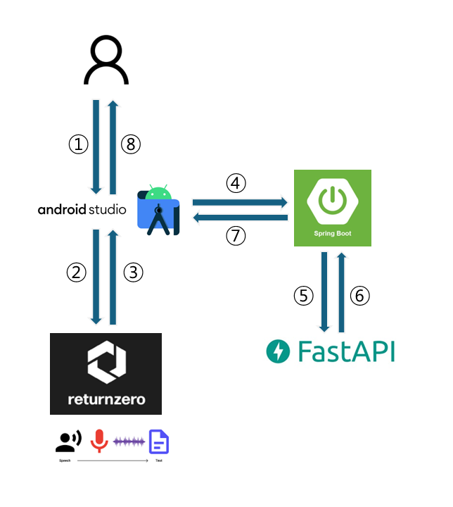

# 🛡️ Integrated Strategy for Voice Phishing Detection and Eradication
### 보이스피싱 탐지 및 근절을 위한 통합 대응 체계 구축 프로젝트

> **"지능화되는 금융 범죄의 고도화된 패턴을 분석하여, 사회적 자산과 개인의 안녕을 수호하기 위한 데이터 기반의 기술적 방벽을 구축합니다."**
>
> *An advanced analytical framework dedicated to the systematic identification, prevention, and neutralization of evolving voice phishing threats.*

---

## 📊 Operational Flowchart (운영 프로세스)

  

---

## 📑 Core Objectives (핵심 과제)
본 프로젝트는 보이스피싱 범죄의 구조적 메커니즘을 규명하고, 실시간 대응 및 사후 방어 체계를 확립하는 데 초점을 맞춥니다.

### 1. 범죄 시나리오 및 패턴 정밀 분석
* **수법의 구조화**: 지인 사칭, 공공기관 사칭 등 유형별 범죄 시나리오의 단계적 분석
* **위험 지표 도출**: 통화 데이터 내 특정 키워드 및 빈도 분석을 통한 고위험군 식별 체계 마련

### 2. 기술적 탐지 및 즉각 대응 체계
* **실시간 모니터링**: 인공지능 및 데이터 분석 기술을 활용한 이상 징후 포착 및 경보 발령
* **행동 차단 기제**: 심리적 지배를 차단하기 위한 시각적·청각적 즉각 알림 시스템 설계

### 3. 사회적 공조 및 예방 인프라 구축
* **기관 연동 프로세스**: 경찰청(112), 금융감독원(1332) 등 유관 기관과의 신속한 신고 및 피해 확산 방지 공조
* **맞춤형 대응 매뉴얼**: 디지털 취약 계층을 위한 직관적이고 실질적인 예방 가이드라인 배포

---

## 🏗️ Technical Specification
* **Analysis Engine**: 통화 패턴 및 텍스트 마이닝 기반 분석
* **Implementation**: 실시간 경보 알고리즘 및 대응 모듈
* **Domain**: 금융 보안 및 모바일 네트워크 보안 솔루션

---

## 📞 Official Contact
* **Project Maintainer**: [kkhwan0822-collab](https://github.com/kkhwan0822-collab)
* **Inquiry**: 기술 협력 및 정책 제안은 [GitHub Issues]를 통해 공식 접수합니다.
